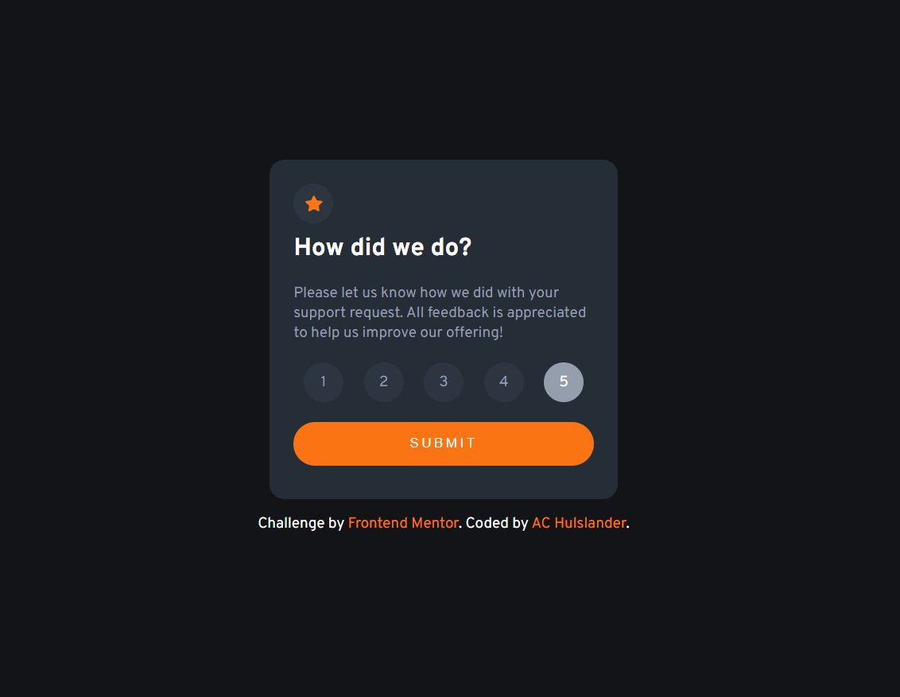
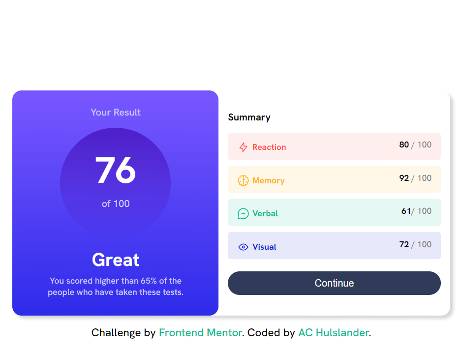
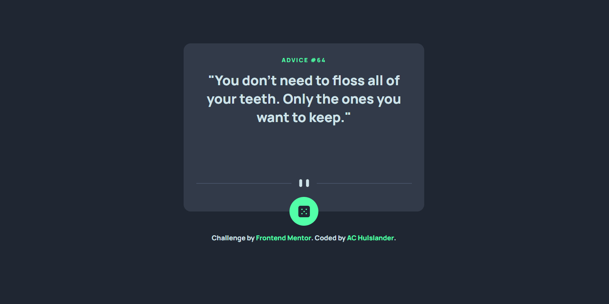
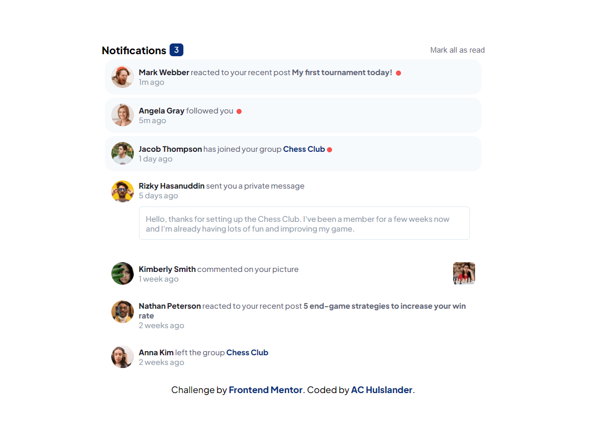
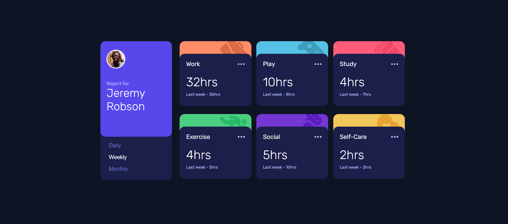
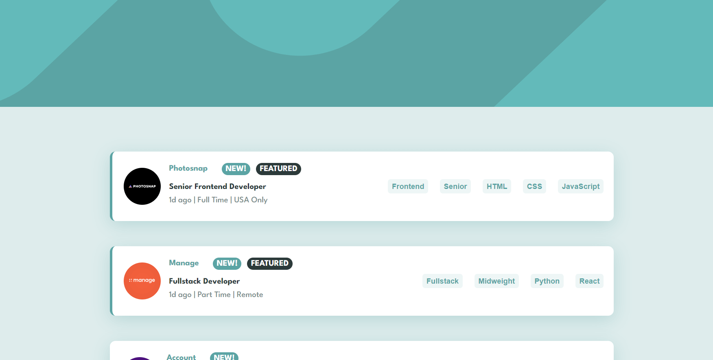
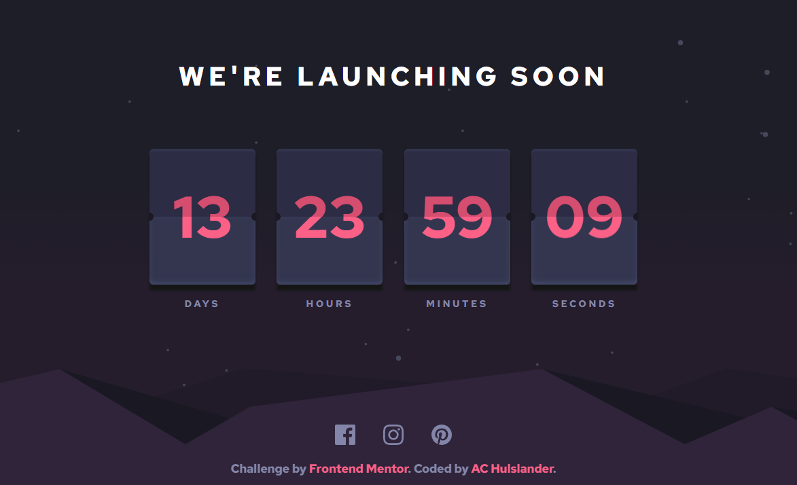
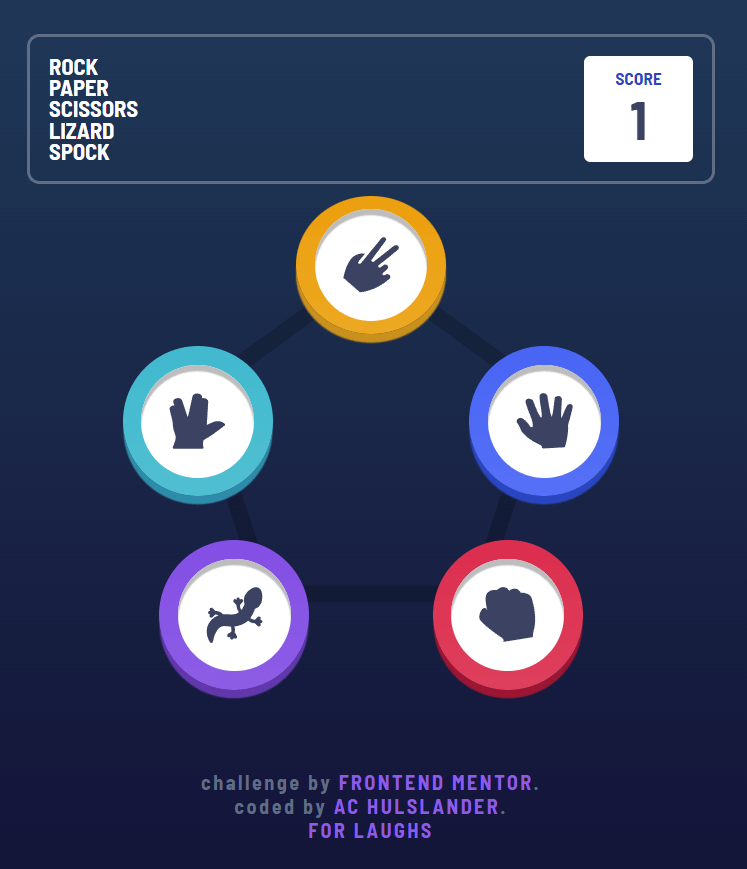
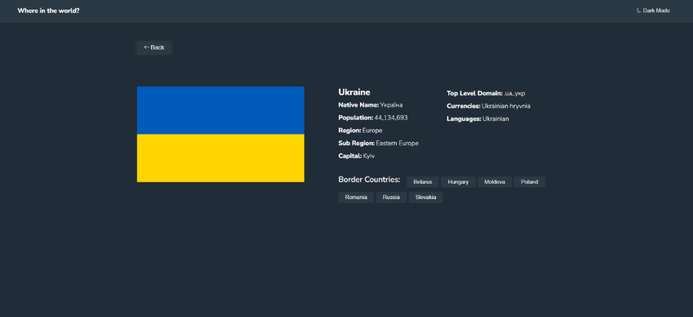

# frontend-mentor

These are the projects I've completed offered from [frontendmentor](https://www.frontendmentor.io/).

## Product Preview Card
#### HTML5 and SCSS

[Visit site](https://achulslander-product-preview-card.netlify.app/)

 

## Interactive Rating
#### HTML5, SCSS, JavaScript

[Visit site](https://achulslander-interactive-rating.netlify.app/)

## Results Summary
#### HTML and SCSS

[Visit site](https://achulslander-results-summary.netlify.app/)

 

## Advice Generator
#### HTML5, SCSS, JavaScript

[Visit site](https://achulslander-advice-generator.netlify.app/)

 

## Notifications Page
#### HTML5, SCSS, JavaScript

[Visit site](https://achulslander-notifications-page.netlify.app/)

 

## Time Tracking
#### HTML5, SCSS, JavaScript

[Visit site](https://achulslander-time-tracking.netlify.app/)

 

## Job Listings
#### ReactJS and SCSS

[Visit site](https://achulslander-job-listings.netlify.app/)

 

## Interactive Comments
#### React, Netlify, Fauna

[Visit site](https://achulslander-interactive-comments.netlify.app/)

## Launch countdown timer
#### HTML5, SCSS, JavaScript

[Visit site](https://achulslander-countdown-timer.netlify.app/)

## rock-paper-scissors-lizard-spock
#### HTML5, SCSS, JavaScript

[Visit site](https://github.com/alleycaaat/frontend-mentor/tree/main/r-p-s-l-s)

## REST Countries API
#### React, Vercel

[Visit site](https://achulslander-countries-api.vercel.app/)

