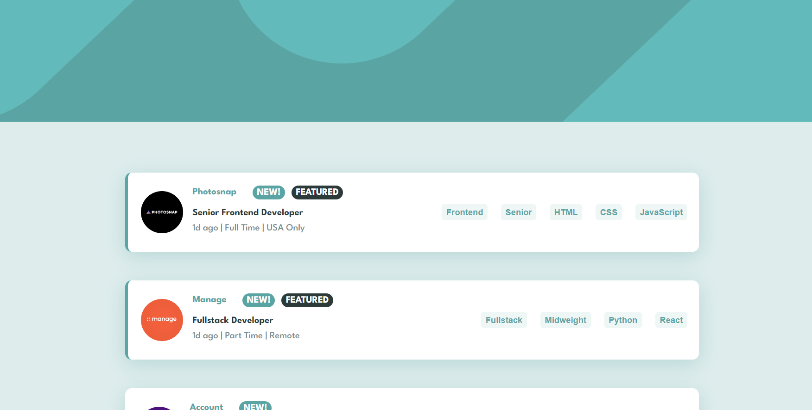

# Frontend Mentor - Job listings with filtering solution

This is a solution to the [Job listings with filtering challenge on Frontend Mentor](https://www.frontendmentor.io/challenges/job-listings-with-filtering-ivstIPCt). Frontend Mentor challenges help you improve your coding skills by building realistic projects.

## Table of contents

- [Overview](#overview)
  - [The challenge](#the-challenge)
  - [Screenshot](#screenshot)
  - [Links](#links)
  - [Built with](#built-with)
- [Author](#author)

## Overview

### The challenge

Users should be able to:

- View the optimal layout for the site depending on their device's screen size
- See hover states for all interactive elements on the page
- Filter job listings based on the categories

### Screenshot

### Links

- Solution URL: [Github](https://github.com/alleycaaat/frontend-mentor/tree/main/job-listings)
- Live Site URL: [Netlify](https://achulslander-job-listings.netlify.app/)

### Built with

- React
- SCSS
- Flexbox
- Mobile-first design

## Author

- Website - [AC Hulslander](https://www.achulslander.com/)
- Frontend Mentor - [@alleycaaat](https://www.frontendmentor.io/profile/alleycaaat)
- Github - [@alleycaaat](https://github.com/alleycaaat/)
- codepen - [@alleycaaat](https://codepen.io/alleycaaat)
- Blog - [@alleycaaat](https://blog-achulslander.com/)
- Twitter - [@alleycaaat](https://www.twitter.com/alleycaaat)