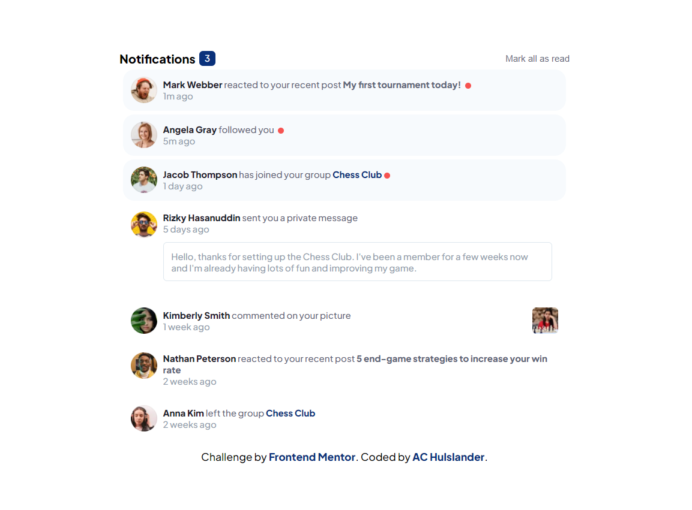

# Frontend Mentor - Notifications page solution

This is a solution to the [Notifications page challenge on Frontend Mentor](https://www.frontendmentor.io/challenges/notifications-page-DqK5QAmKbC). Frontend Mentor challenges help you improve your coding skills by building realistic projects.

## Table of contents

- [Overview](#overview)
  - [The challenge](#the-challenge)
  - [Screenshot](#screenshot)
  - [Links](#links)
- [My process](#my-process)
  - [Built with](#built-with)
- [Author](#author)

**Note: Delete this note and update the table of contents based on what sections you keep.**

## Overview

### The challenge

Users should be able to:

- Distinguish between "unread" and "read" notifications
- Select "Mark all as read" to toggle the visual state of the unread notifications and set the number of unread messages to zero
- View the optimal layout for the interface depending on their device's screen size
- See hover and focus states for all interactive elements on the page

### Screenshot

### Links

- Solution URL: [GitHub](https://github.com/alleycaaat/frontend-mentor/tree/main/notifications-page)
- Live Site URL: [Add live site URL here](https://achulslander-notifications-page.netlify.app/)

## My process

### Built with

- Semantic HTML5 markup
- SCSS
- Flexbox
- Mobile-first design
- Vanilla JS

## Author

- Website - [AC Hulslander](https://www.achulslander.com/)
- Frontend Mentor - [@alleycaaat](https://www.frontendmentor.io/profile/alleycaaat)
- GitHub - [@alleycaaat](https://github.com/alleycaaat/)
- codepen - [@alleycaaat](https://codepen.io/alleycaaat)
- Blog - [@alleycaaat](https://blog-achulslander.com/)
- Twitter - [@alleycaaat](https://www.twitter.com/alleycaaat)