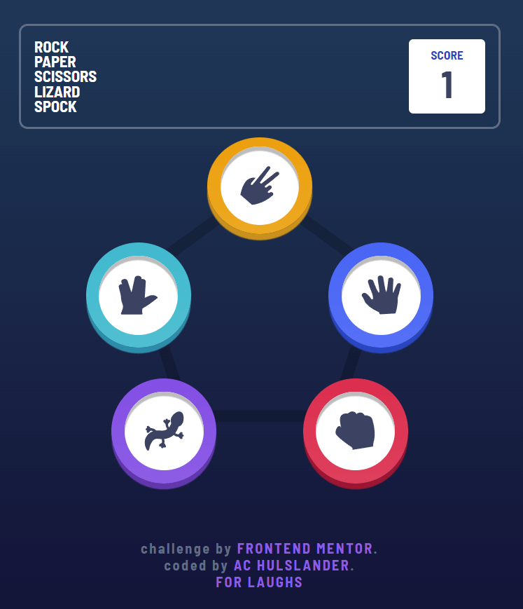
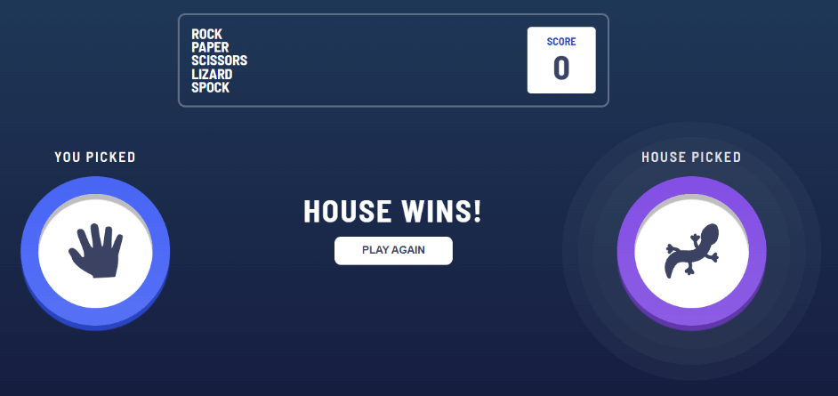

# Frontend Mentor - Rock, Paper, Scissors solution

This is a solution to the [Rock, Paper, Scissors challenge on Frontend Mentor](https://www.frontendmentor.io/challenges/rock-paper-scissors-game-pTgwgvgH). Frontend Mentor challenges help you improve your coding skills by building realistic projects.

## Table of contents

- [Overview](#overview)
  - [The challenge](#the-challenge)
  - [Screenshot](#screenshot)
  - [Links](#links)
  - [Built with](#built-with)
- [Author](#author)

## Overview

### The challenge

Users should be able to:

- View the optimal layout for the game depending on their device's screen size
- Play Rock, Paper, Scissors against the computer
- Maintain the state of the score after refreshing the browser _(optional)_
- **Bonus**: Play Rock, Paper, Scissors, Lizard, Spock against the computer _(optional)_

### Screenshot

### Links

- Solution URL: [Github](https://github.com/alleycaaat/frontend-mentor/tree/main/r-p-s-l-s)
- Live Site URL: [Vercel](https://achulslander-r-p-s-l-s.vercel.app/)
- View the SCSS: [codepen[(https://codepen.io/alleycaaat/pen/ExdXbzv)

### Built with

- HTML5
- SCSS
- Flexbox
- Mobile-first design

## Author

- Website - [AC Hulslander](https://www.achulslander.com/)
- Frontend Mentor - [@alleycaaat](https://www.frontendmentor.io/profile/alleycaaat)
- Github - [@alleycaaat](https://github.com/alleycaaat/)
- codepen - [@alleycaaat](https://codepen.io/alleycaaat)
- Blog - [@alleycaaat](https://blog-achulslander.com/)
- Twitter - [@alleycaaat](https://www.twitter.com/alleycaaat)
