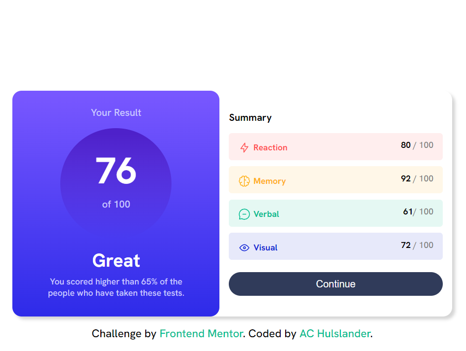

# Frontend Mentor - Results summary component solution

This is a solution to the [Results summary component challenge on Frontend Mentor](https://www.frontendmentor.io/challenges/results-summary-component-CE_K6s0maV). Frontend Mentor challenges help you improve your coding skills by building realistic projects.

## Table of contents

- [Overview](#overview)
  - [The challenge](#the-challenge)
  - [Screenshot](#screenshot)
  - [Links](#links)
- [My process](#my-process)
  - [Built with](#built-with)
  - [Useful resources](#useful-resources)
- [Author](#author)
- [Acknowledgments](#acknowledgments)

**Note: Delete this note and update the table of contents based on what sections you keep.**

## Overview

### The challenge

Users should be able to:

- View the optimal layout for the interface depending on their device's screen size
- See hover and focus states for all interactive elements on the page

### Screenshot

### Links

- Solution URL: [GitHub](https://github.com/alleycaaat/frontend-mentor/tree/main/results-summary)
- Live Site URL: [Netlify](https://achulslander-results-summary.netlify.app)

### My process

Look at the example, remember I can have a hard time distinguishing colors.  Ope.  Start coding, get annoyed at static coding HTML, know there's a better way to do this but carry on the way we're going.  Finish, celebrate our ...success?

### Built with

- Semantic HTML5 markup
- SCSS
- Flexbox
- Mobile-first design

### Useful resources

- [Gradient generator](https://cssgradient.io/) - Makes adding gradients a breeze.

## Author

- Website - [AC Hulslander](https://www.achulslander.com/)
- Frontend Mentor - [@alleycaaat](https://www.frontendmentor.io/profile/alleycaaat)
- GitHub - [@alleycaaat](https://github.com/alleycaaat/)
- codepen - [@alleycaaat](https://codepen.io/alleycaaat)
- Hashnode - [@alleycaaat](https://hashnode.com/@alleycaaat)
- Discord - [alleycaaat#0802](https://discordapp.com/users/427569685366833174)
- Twitter - [@alleycaaat](https://www.twitter.com/alleycaaat)
- Blog - [blog.achulslander.com](https://blog.achulslander.com/)

## Acknowledgments

I acknowledge I haven't made anything in strictly HTML and SCSS in ages, I forgot how annoying static coding can be.  It's pretty clunky overall, but given the short amount of time I invested, and that I've been focusing on frameworks and libraries lately, it's unsurprising.
