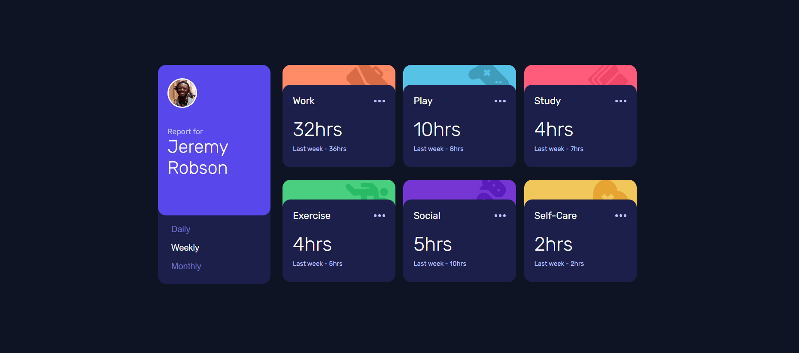

# Frontend Mentor - Time tracking dashboard solution

This is a solution to the [Time tracking dashboard challenge on Frontend Mentor](https://www.frontendmentor.io/challenges/time-tracking-dashboard-UIQ7167Jw). Frontend Mentor challenges help you improve your coding skills by building realistic projects.

## Table of contents

- [Overview](#overview)
  - [The challenge](#the-challenge)
  - [Screenshot](#screenshot)
  - [Links](#links)
- [My process](#my-process)
  - [Built with](#built-with)
- [Author](#author)

## Overview

### The challenge

Users should be able to:

- View the optimal layout for the site depending on their device's screen size
- See hover states for all interactive elements on the page
- Switch between viewing Daily, Weekly, and Monthly stats

### Screenshot

### Links

- Solution URL: [https://github.com/alleycaaat/frontend-mentor/tree/main/time-tracking](https://github.com/alleycaaat/frontend-mentor/tree/main/time-tracking)
- Live Site URL: [https://achulslander-time-tracking.netlify.app/](https://achulslander-time-tracking.netlify.app/)

## My process

### Built with

- Semantic HTML5 markup
- SCSS
- Flexbox
- Mobile-first design

## Author

- Website - [AC Hulslander](https://www.achulslander.com/)
- Frontend Mentor - [@alleycaaat](https://www.frontendmentor.io/profile/alleycaaat)
- GitHub - [@alleycaaat](https://github.com/alleycaaat/)
- codepen - [@alleycaaat](https://codepen.io/alleycaaat)
- Hashnode - [@alleycaaat](https://hashnode.com/@alleycaaat)
- Discord - [alleycaaat#0802](https://discordapp.com/users/427569685366833174)
- Twitter - [@achulslander](https://www.twitter.com/achulslander)
- Blog - [blog.achulslander.com](https://blog.achulslander.com/)